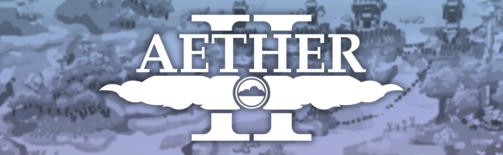

# The Aether II

*Work in progress...*

## :heart: Support The Aether Team

[](https://patreon.com/TheAetherTeam)
[](https://discord.gg/aethermod)
[](https://twitter.com/DevAether)
[](https://mastodon.gamedev.place/@DevAether)
[](https://www.facebook.com/AetherMod)
[](https://www.youtube.com/@DevAether)
[](https://www.twitch.tv/theaetherteam)
[](https://www.reddit.com/r/TheAether/)

If you enjoy our work, [please consider making a pledge](https://patreon.com/TheAetherTeam) today to help fund development. Every pledge goes directly into our development process and services, enabling us to continue making the Minecraft mods you know and love.

You can also support the Aether project and The Aether Team by telling your friends, joining our Discord server, and sharing our progress and announcements on social media. Every bit helps!

If you're interested in sponsoring the Aether project or The Aether Team, please [contact Oz#1986 on the Aether Community Discord](https://discord.gg/aethermod).

## :package: Download the latest releases
[](https://files.minecraftforge.net/net/minecraftforge/forge/)
[]()
[]()
[]()
[]()
[](https://app.circleci.com/pipelines/github/The-Aether-Team/The-Aether-II?branch=1.19.4-develop)
### Release builds
The Aether II has no stable release builds for the latest version of Minecraft just yet, but this port is in active development so keep an eye out for its eventual release.

### Bleeding edge builds
If you’re feeling a bit more adventurous or wish to help test the in-development versions, we provide **bleeding edge builds** which are produced on [CircleCI](https://app.circleci.com/pipelines/github/The-Aether-Team/The-Aether-II). These builds are created for every new commit and contain the latest available code. We do not recommend users treat these builds as releases, as they are unfinished and may contain serious issues. If you wish to download these builds, check out [this guide](https://github.com/The-Aether-Team/The-Aether-II/wiki/CircleCI-Guide).

### Packages
To install this mod through GitHub Packages in Gradle for development, you will need the [Gradle Github Packages Plugin](https://github.com/0ffz/gpr-for-gradle). To use it, make sure you have access to the Gradle plugins maven and the plugin as a buildscript dependency:

<details>
<summary> Buildscript Code</summary>

```
buildscript {
  repositories {
    ...
    maven {
        name 'Gradle'
        url "https://plugins.gradle.org/m2/"
    }
  }
  dependencies {
    ...
    classpath group: 'io.github.0ffz', name: 'gpr-for-gradle', version: '1.+', changing: true
  }
}
...
apply plugin: 'io.github.0ffz.github-packages'
```

</details>

Then you need to specify the package you want to use in your repository:

<details>
<summary> Repositories Code</summary>

```
repositories {
  ...
  maven githubPackage.invoke("The-Aether-Team/The-Aether-II")
}
```

</details>

Then load it through your dependencies, with `project.aether_ii_version` specified in the `gradle.properties`:

<details>
<summary> Dependencies Code</summary>

```
dependencies {
  ...
  compileOnly "com.aetherteam.aether_ii:aether_ii:${project.aether_ii_version}"
  runtimeOnly fg.deobf("com.aetherteam.aether_ii:aether_ii:${project.aether_ii_version}")
  ...
}
```

</details>

## :bug: Report bugs or other issues
If you're running into bugs or other problems, feel free to open an issue on our [issue tracker](https://github.com/The-Aether-Team/The-Aether-II/issues). When doing so, make sure to use one of the provided templates and fill out all the requested information. Make sure to keep your issue's description clear and concise. Your issue's title should also be easy to digest, giving our developers and reporters a good idea of what's wrong without including too many details. Failure to follow any of the above may result in your issue being closed.

## :wrench: Contribute to the project
Looking to contribute to the project? We ask that you read over our [Contributor's Guide](https://github.com/The-Aether-Team/The-Aether-II/blob/1.19.4-develop/docs/CONTRIBUTING.md) for more details as well as our [Contributor License Agreement (CLA)](https://github.com/The-Aether-Team/The-Aether-II/blob/1.19.4-develop/docs/AGREEMENT.md) before getting started.

Not sure what to help with? Take a look at our issue tracker for some ideas! [Here's a quick link](https://github.com/The-Aether-Team/The-Aether-II/labels/status%2Fhelp-wanted) which shows all the currently open issues that we'd love some help on.

## :scroll: License information
[](https://en.wikipedia.org/wiki/All_rights_reserved)
[](https://github.com/The-Aether-Team/The-Aether-II/blob/1.19.4-develop/LICENSE.txt)

If you're wanting to create a gameplay video/review, extension or addon, parody, or any other fan work of your own for The Aether II, go for it! We love seeing the content our community creates, and we hope to make it as welcoming as possible for everyone. We ask however that you please don't advertise using our brand (our specific logo assets, team name, official social media posts).

If you are thinking about using the Aether project's code or assets, please note our licensing. **All assets of The Aether II are unlicensed and all rights are reserved to them by The Aether Team and their respective authors.** The source code of The Aether II mod for Minecraft 1.10+ is under the LGPL v3.0 license. Any previous versions' source code is unlicensed and all rights are reserved to it by The Aether Team.

If you have a reason that you wish to use our brand or any unlicensed material, please [get in contact with Oz#1986 on the Aether Community Discord](https://discord.gg/aethermod) for details.

## :star2: Special mentions
### :speech_balloon: Translations

*Work in progress...*

### :hammer: Contributions
All of our code contribution credits can be found [here](https://github.com/The-Aether-Team/The-Aether-II/blob/1.19.4-develop/docs/CREDITS.txt). If you contributed to the project and do not see your name, please contact us.

### :file_folder: Dependencies
The Aether would not be possible without the features provided by the APIs and libraries it implements. Thanks goes to:
| Library | Information |
| ------- | ----------- |
| [](https://www.curseforge.com/minecraft/mc-mods/curios) | Curios API was created by [C4](https://github.com/TheIllusiveC4).<br />The source can be found at https://github.com/TheIllusiveC4/Curios.<br />The dependency is licensed under [LGPL v3](https://www.gnu.org/licenses/lgpl-3.0). |
| [](https://www.curseforge.com/minecraft/mc-mods/geckolib) | Geckolib was created by [Gecko](https://github.com/bernie-g).<br />The source can be found at https://github.com/bernie-g/geckolib.<br />The dependency is licensed under [MIT](https://opensource.org/license/mit/). |
| [](https://www.curseforge.com/minecraft/mc-mods/smartbrainlib) | SmartBrainLib was created by [Tslat](https://github.com/Tslat).<br />The source can be found at https://github.com/Tslat/SmartBrainLib.<br />The dependency is licensed under [Mozilla Public License 2.0](https://www.mozilla.org/en-US/MPL/2.0/). |
